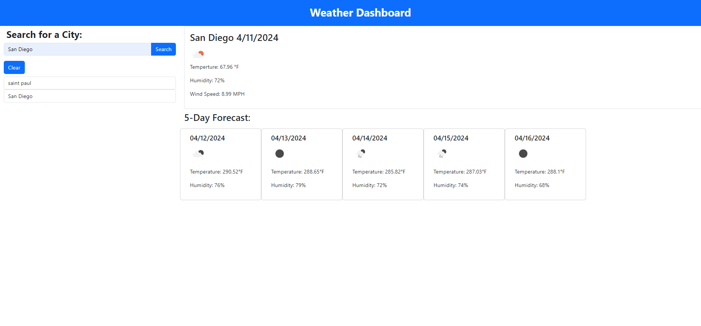
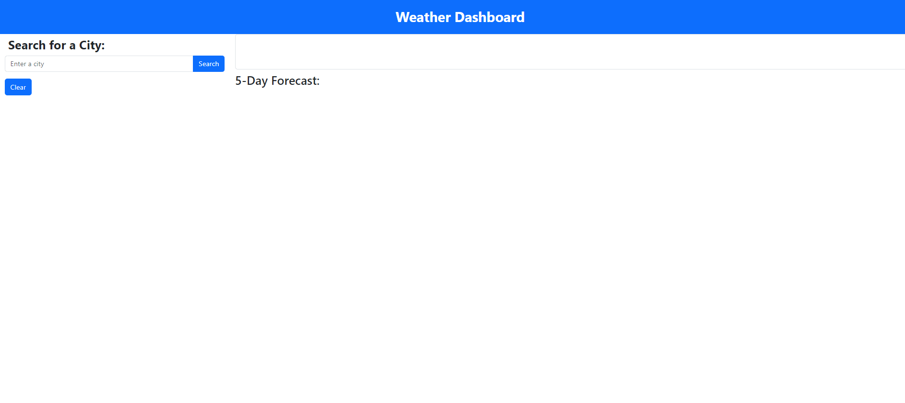

# Weather-Dashboard

## Description

The reason for creating this weather dashboard is for anyone to open it up and get the weather for whatever city they want. While creating this website I learned how to use fetch in order to collect data from a weather application programming interface or API for short.

## Installation

N/A

## Usage

To use this weather dashboard simply enter in a city name into the search bar. To the right of the search bar the current weather will populate for that city. Below that it'll show the forecast for the next 5 days.

## Deployed Links

## Snapshots

